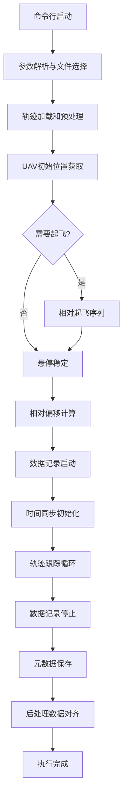

# Simple Trajectory Collector Analysis - 执行流程详解

## 概述

`simple_trajectory_collector_analysis.py` 是一个改进版的UAV轨迹数据采集器，与基础版本相比具有以下核心改进：

- **相对飞行模式**：从UAV当前位置开始飞行，而不是teleport到轨迹起点
- **数据后处理对齐**：将记录的观测数据与原始轨迹坐标对齐
- **健壮的起飞控制**：多线程setpoint流确保稳定的起飞过程
- **速度缩放修复**：正确处理时间缩放对动力学参数的影响

## 执行流程图



## 详细执行流程

### 1. 命令行启动与参数解析

**执行位置**: `if __name__ == "__main__"` 代码块

**功能说明**:
- 支持两种文件选择模式：
  - **指定文件模式**: `--json-file /path/to/trajectory.json`
  - **目录选择模式**: `--input-dir /path/to/json/dir` (按uav_id取模选择)

**关键参数**:
- `--uav-id`: UAV编号(0-7)，影响端口选择和文件分配
- `--scale`: 轨迹坐标缩放因子(默认0.01，将米缩放到厘米级)
- `--time-scale`: 时间缩放因子(默认2.5，加快轨迹执行速度)
- `--control-base`: 控制服务URL(默认 http://127.0.0.1:5009)
- `--image-base`: 图像/位姿服务URL(默认 http://127.0.0.1:8081)

### 2. 轨迹加载和预处理

**执行位置**: `run_collector()` 函数开头

**具体步骤**:

#### 2.1 JSON轨迹文件读取
```python
with open(json_path) as f:
    data = json.load(f)
raw_logs = data.get("raw_logs", [])
```

#### 2.2 坐标缩放变换
```python
scaled_points = [[r[0]*scale, r[1]*scale, r[2]*scale, r[3], r[4], r[5]]
                 for r in raw_logs]
```

#### 2.3 轨迹平滑处理
```python
smoother = TrajectorySmoother(scaled_points, dt=0.2)
total_duration = smoother.duration / time_scale
```

**输出**: 创建 `TrajectorySmoother` 对象，提供连续的轨迹函数

#### 2.4 输出目录创建
```
traj_dir/
└── uav{uav_id}/
    ├── data.csv (将要生成的)
    └── metadata.json (将要生成的)
```

### 3. UAV初始位置获取

**执行位置**: 相对飞行核心逻辑

**关键改进**: **分析版本的最大创新点**

**传统方法**: teleport到轨迹起点
**分析版本**: 从当前位置开始相对飞行

#### 3.1 等待仿真器准备
```python
while time.time() - wait_pose_start < 120.0:
    pose = _fetch_pose_only(image_base, uav_id)
    if pose and pose.get("position"):
        break
```

#### 3.2 提取当前位置
```python
start_pos_sim = pose.get("position", [0,0,0])
current_x, current_y, current_z = start_pos_sim
```

#### 3.3 计算起飞目标
```python
takeoff_target = [current_x, current_y, TARGET_ALT]  # XY保持，Z爬升
```

### 4. 相对起飞序列

**执行位置**: 当 `current_z < TARGET_ALT - ALT_TOLERANCE` 时

**核心创新**: **多线程setpoint流**

#### 4.1 起飞命令准备
```python
takeoff_cmd = {
    "cmd": "setpoint",
    "x": takeoff_target[0], "y": takeoff_target[1], "z": TARGET_ALT,
    "vx": 0.0, "vy": 0.0, "vz": 0.5,  # 0.5m/s爬升速度
    "yaw": smoother.get_yaw_and_rate(0)[0]
}
```

#### 4.2 多线程Setpoint流启动
```python
def stream_setpoints():
    while not stop_streaming.is_set():
        _http_json("POST", f"{control_base}/command", payload=takeoff_cmd, timeout=0.1)
        time.sleep(0.05)  # 20Hz

stream_thread = threading.Thread(target=stream_setpoints)
stream_thread.start()
```

#### 4.3 ARM无人机
```python
for attempt in range(30):
    code, resp = _http_json("POST", f"{control_base}/command", {"cmd": "arm"})
    if 200 <= code < 300 and resp.get("ok"):
        break
```

#### 4.4 切换OFFBOARD模式
```python
for attempt in range(10):
    code, resp = _http_json("POST", f"{control_base}/command",
                           {"cmd": "set_mode", "mode": "OFFBOARD"})
```

#### 4.5 监控爬升过程
```python
while time.time() - takeoff_start < 45.0:
    pose = _fetch_pose_only(image_base, uav_id)
    current_z = pose.get("position", [0,0,0])[2]
    if abs(current_z - TARGET_ALT) < ALT_TOLERANCE:
        break
```

#### 4.6 停止Setpoint流
```python
stop_streaming.set()
stream_thread.join()
```

### 5. 悬停稳定

**执行位置**: 起飞完成后

**目的**: 确保UAV在轨迹起点稳定悬停，准备开始轨迹跟踪

#### 5.1 发送悬停命令
```python
cmd = {
    "cmd": "setpoint",
    "x": takeoff_target[0], "y": takeoff_target[1], "z": TARGET_ALT,
    "vx": 0.0, "vy": 0.0, "vz": 0.0,  # 零速度悬停
}
```

#### 5.2 速度稳定性检查
```python
vel = pose.get("linear_velocity", [0,0,0])
v_mag = math.sqrt(vel[0]**2 + vel[1]**2 + vel[2]**2)
if v_mag < 0.05:  # 速度小于5cm/s认为稳定
    stable = True
    actual_start_pos = pose.get("position")
```

### 6. 相对偏移计算

**执行位置**: UAV稳定后

**核心概念**: 计算实际起始位置与参考轨迹起始位置的偏移

```python
# Offset = Actual_Start_Pos - Reference_Traj_Start
offset_x = actual_start_pos[0] - traj_start['x']
offset_y = actual_start_pos[1] - traj_start['y']
offset_z = actual_start_pos[2] - traj_start['z']  # 用于后期数据对齐
```

**设计理念**:
- XY偏移: 飞行时应用，使UAV从当前位置开始跟踪轨迹
- Z偏移: 仅用于数据后处理，飞行时Z轴使用绝对坐标

### 7. 数据记录启动

**执行位置**: 偏移计算完成后

#### 7.1 查找PX4日志文件
```python
possible_roots = [
    Path("/tmp"),
    Path("/home/user/PX4-Autopilot/build/px4_sitl_default/rootfs/fs/microsd/log")
]

for root in possible_roots:
    candidates = list(root.glob(f"px4_{uav_id}_*/log/**/*.ulg"))
```

#### 7.2 启动服务端记录
```python
_http_json("POST", f"{image_base}/uav/{uav_id}/buffer/start", {
    "save_dir": str(uav_dir.absolute()),
    "traj_json": str(json_path.absolute()),
    "traj_name": json_path.stem,
    "ulg_path": ulg_path
})
```

### 8. 时间同步初始化

**执行位置**: 数据记录启动后

#### 8.1 创建时间监听器
```python
time_listener = SimTimeListener(f"{image_base}/sim_time")
time_listener.start()
```

#### 8.2 等待时间同步
```python
while time_listener.get_time() <= 0 and time.time() - wait_start < 10.0:
    time.sleep(0.1)

sim_start_ts = time_listener.get_time()
```

### 9. 轨迹跟踪循环

**执行位置**: 时间同步完成后

这是整个系统的**核心控制循环**

#### 9.1 循环控制结构
```python
max_real_time = total_duration * 2 + 30.0  # 超时保护
LOOKAHEAD_TIME = 0.2  # 200ms前瞻控制

while True:
    # 超时检查
    if time.time() - traj_start_real > max_real_time:
        break

    # 时间同步等待
    current_sim_ts = time_listener.wait_for_advance(last_cmd_sim_ts, timeout=1.0)

    # 计算轨迹时间
    elapsed = (current_sim_ts - sim_start_ts) * time_scale

    # 轨迹结束检查
    if elapsed >= smoother.duration:
        break
```

#### 9.2 前瞻状态获取
```python
# 获取前瞻时刻的状态 (当前时间 + 200ms)
state = smoother.get_full_state(elapsed + LOOKAHEAD_TIME * time_scale)
```

#### 9.3 速度和加速度缩放

**关键修复**: 正确处理时间缩放的影响

```python
# 速度缩放: vx' = vx * time_scale
vx_scaled = state['vx'] * time_scale
vy_scaled = state['vy'] * time_scale
vz_scaled = state['vz'] * time_scale

# 加速度缩放: ax' = ax * (time_scale)^2
ax_scaled = state['ax'] * (time_scale ** 2)
ay_scaled = state['ay'] * (time_scale ** 2)
az_scaled = state['az'] * (time_scale ** 2)
```

#### 9.4 相对位置控制
```python
# XY轴: 应用相对偏移
target_x = state['x'] + offset_x
target_y = state['y'] + offset_y

# Z轴: 保持绝对坐标
target_z = state['z']
```

#### 9.5 控制命令发送

**优先方式**: UDP MAVLink
```python
if use_udp:
    sender.send_pva(target_x, target_y, target_z,
                   vx_scaled, vy_scaled, vz_scaled,
                   ax_scaled, ay_scaled, az_scaled,
                   state['yaw'], state['yaw_rate'] * time_scale)
```

**回退方式**: HTTP
```python
else:
    cmd = {
        "cmd": "setpoint",
        "x": target_x, "y": target_y, "z": target_z,
        "vx": vx_scaled, "vy": vy_scaled, "vz": vz_scaled,
        "afx": ax_scaled, "afy": ay_scaled, "afz": az_scaled,
        "yaw": state['yaw'], "yaw_rate": state['yaw_rate'] * time_scale
    }
    _http_json("POST", f"{control_base}/command", payload=cmd, timeout=0.5)
```

### 10. 数据记录停止

**执行位置**: 轨迹跟踪循环结束后

```python
code, resp = _http_json("POST", f"{image_base}/uav/{uav_id}/buffer/stop", {})
state_count = resp.get("state_count", 0)
```

### 11. 元数据保存

**执行位置**: 记录停止后

```python
meta = {
    "traj_name": json_path.stem,
    "uav_id": uav_id,
    "duration": total_duration,
    "points": state_count,
    "scale": scale,
    "time_scale": time_scale,
    "relative_offset_x": offset_x,
    "relative_offset_y": offset_y,
    "relative_offset_z": offset_z
}
with open(uav_dir / "metadata.json", "w") as f:
    json.dump(meta, f, indent=4)
```

### 12. 后处理数据对齐

**执行位置**: 元数据保存后

**核心功能**: 将记录的观测位置数据与原始轨迹坐标对齐

#### 12.1 读取CSV数据
```python
with open(data_csv, 'r') as f:
    lines = f.readlines()
```

#### 12.2 坐标偏移应用
```python
# 对齐原理: obs_new = obs_old - diff
val_x = float(parts[idx_x])
val_y = float(parts[idx_y])
val_z = float(parts[idx_z])

parts[idx_x] = f"{val_x - dx:.8f}"
parts[idx_y] = f"{val_y - dy:.8f}"
parts[idx_z] = f"{val_z - dz:.8f}"
```

#### 12.3 安全文件写入
```python
temp_csv = uav_dir / "data_aligned.csv"
with open(temp_csv, 'w') as f:
    f.writelines(new_lines)
shutil.move(str(temp_csv), str(data_csv))  # 原子替换
```

## 输出文件结构

```
output_dir/
├── trajectory_name/
│   ├── trajectory.json (复制的原始轨迹文件)
│   └── uav{uav_id}/
│       ├── data.csv (对齐后的观测数据)
│       ├── metadata.json (轨迹信息和偏移参数)
│       └── (其他服务端生成的文件)
```

## 关键技术特点

### 1. 相对飞行模式
- 从UAV当前位置开始飞行
- 适应不同的初始位置
- 更符合真实飞行场景

### 2. 健壮的控制策略
- 多线程setpoint流确保命令送达
- 超时保护防止执行卡住
- 通信回退机制 (UDP → HTTP)

### 3. 精确的时间同步
- 仿真时间监听器
- 前瞻控制策略
- 动态超时计算

### 4. 数据完整性保证
- 后处理对齐确保数据一致性
- 元数据完整记录所有参数
- 安全文件写入防止数据损坏

## 使用示例

### 基本用法
```bash
python3 simple_trajectory_collector_analysis.py \
    --json-file trajectory.json \
    --out-dir ./output \
    --uav-id 0
```

### 批处理模式
```bash
python3 simple_trajectory_collector_analysis.py \
    --input-dir /path/to/trajectories \
    --out-dir ./output \
    --uav-id 0 \
    --scale 0.01 \
    --time-scale 2.5
```

---

*文档生成时间: 2026年1月19日*
*对应代码版本: simple_trajectory_collector_analysis.py (973行)*
